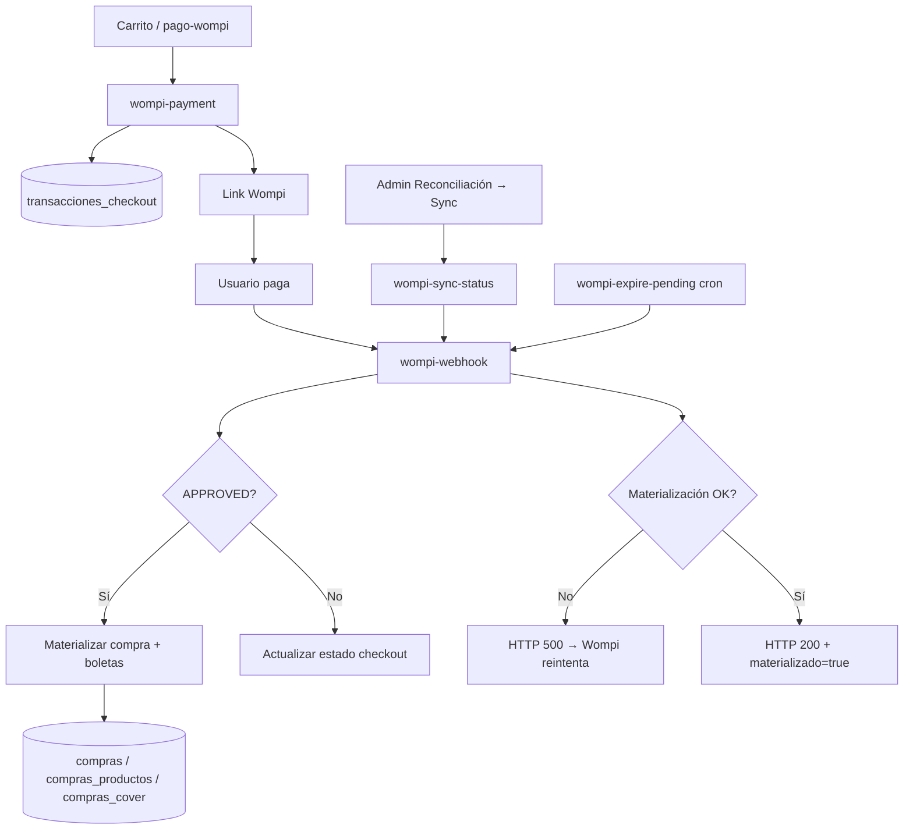
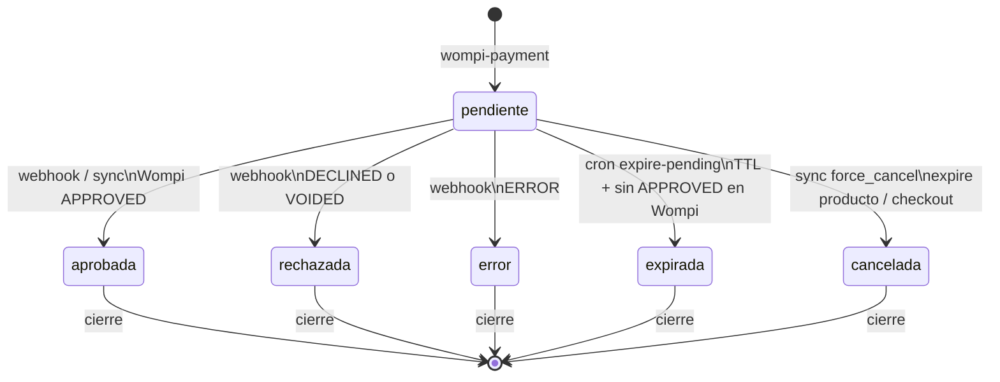
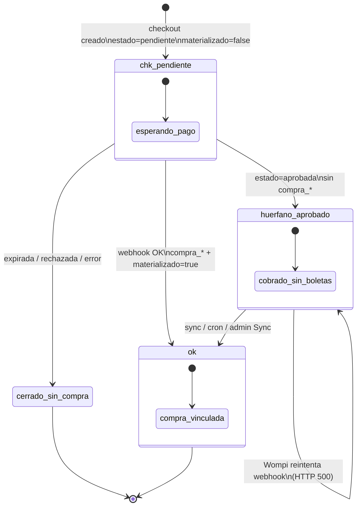
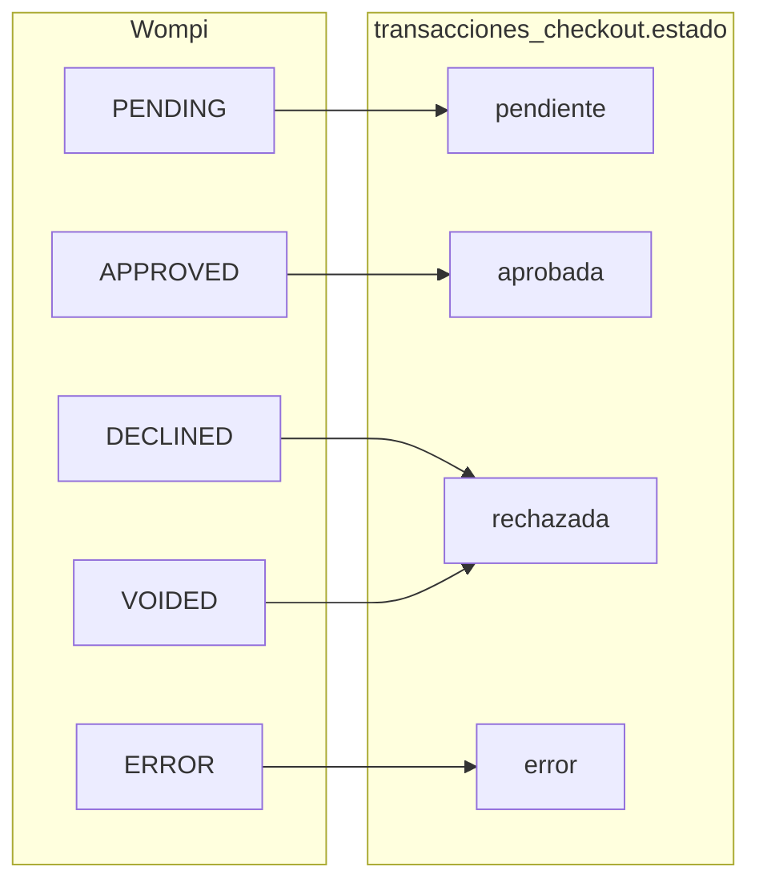
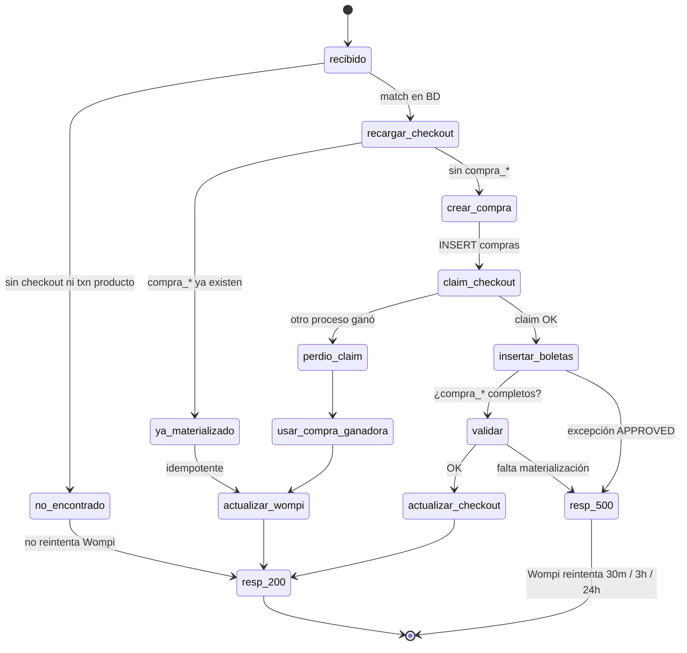
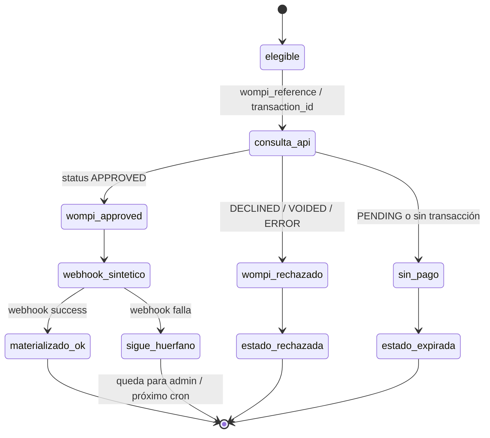
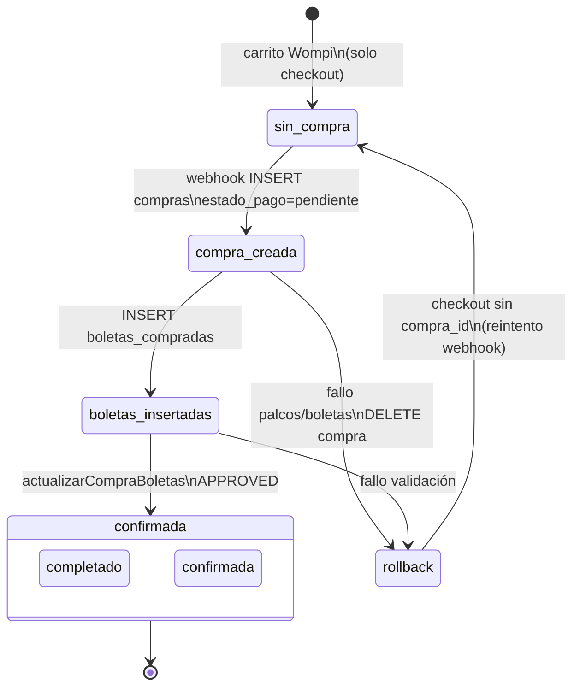
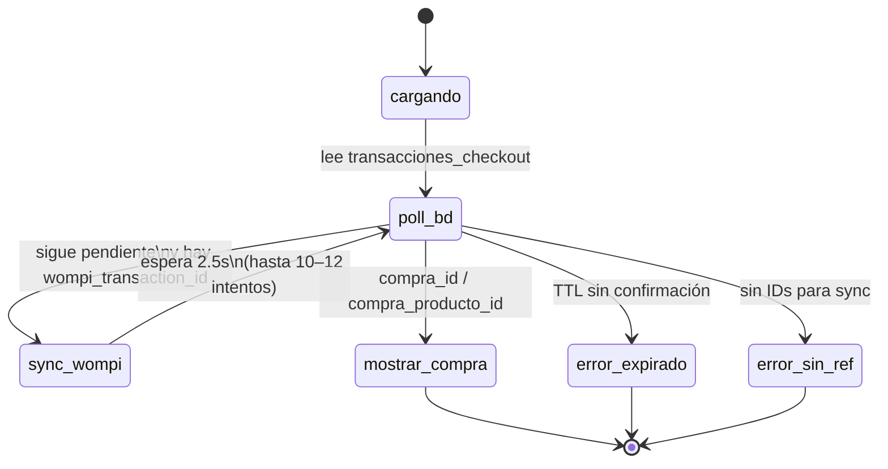
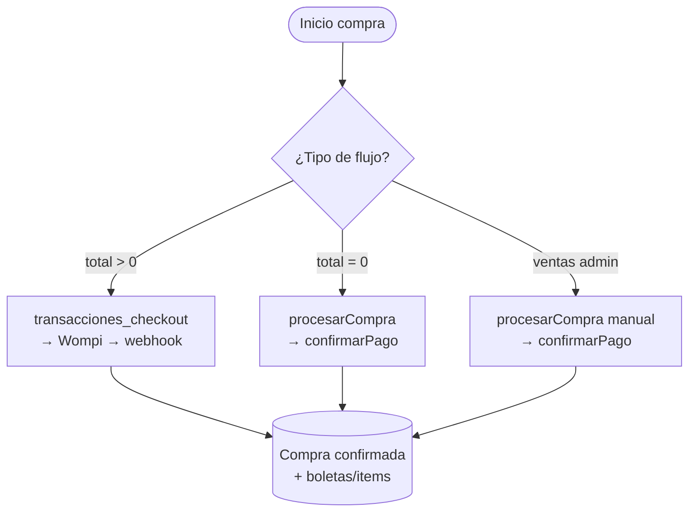

# Flujo de compras Eventum (Wompi + reconciliación)

Documentación del flujo de pagos, materialización de compras y reconciliación cuando Wompi o el webhook no cierran el ciclo a tiempo.

**Última actualización:** 2026-08-05 (diagramas de estado añadidos)

---

## Resumen

Eventum separa **intento de pago** (checkout) de **compra materializada** (filas en `compras`, `compras_productos`, `compras_cover` + boletas/items).

| Fase | Qué pasa |
|------|----------|
| 1. Carrito | El usuario arma el pedido; no se crean compras finales (salvo total $0). |
| 2. Checkout | `wompi-payment` crea `transacciones_checkout` + link Wompi. |
| 3. Pago | Wompi cobra; envía webhook `transaction.updated`. |
| 4. Materialización | `wompi-webhook` crea compras/boletas solo si status = **APPROVED**. |
| 5. Red de seguridad | Cron, sync manual y panel admin recuperan huérfanos. |

→ Diagramas de estado detallados en [Diagramas de estado](#diagramas-de-estado).

---

## Tipos de compra

| `tipo` en checkout | Contenido | Tablas finales |
|--------------------|-----------|----------------|
| `boletas` | Entradas / palcos | `compras` + `boletas_compradas` |
| `productos` | Bar, merchandising | `compras_productos` + items |
| `mixto` | Boletas + productos | Ambas |
| `cover` | Cover nocturno | `compras_cover` + `boletas_cover` |
| `cover_mixto` | Cover + productos | Cover + productos |

El carrito (`src/app/pages/carrito/carrito.ts`) arma el body según lo que haya en el carrito y llama a `wompi-payment`.

---

## Diagrama general (pago Wompi)



**Regla clave:** sync, cron y admin **no insertan boletas directamente**. Todos delegan en `wompi-webhook` (webhook sintético con payload de la API Wompi).

---

## Flujo 1 — Pago con Wompi (total > 0)

### 1.1 Frontend: carrito → pago

1. Usuario autenticado en `/carrito` (o flujo cover).
2. Validación de disponibilidad (boletas, productos, covers).
3. POST a edge function **`wompi-payment`** con:
   - `amount_in_cents`, `customer_email`, `redirect_url`
   - `tipo` + `pedido_boletas` / `pedido_productos` / `pedido_covers`
4. Redirección a **`/pago-wompi`** con URL de checkout Wompi.
5. Tras pagar, Wompi redirige a **`/pago-resultado`**.

**No se crean** filas en `compras` ni `boletas_compradas` en este paso.

### 1.2 Edge: `wompi-payment`

- Archivo: `supabase/functions/wompi-payment/index.ts`
- Versión actual: `3.1.0-covers-independiente`
- Crea fila en **`transacciones_checkout`** con:
  - `estado = pendiente`, `materializado = false`
  - `request_payload` = snapshot del pedido (para materializar después)
  - `numero_intento` único (`WCHK-...`)
- Genera referencia interna: **`EVENTUM-CHK-TXN-{checkoutId}-{timestamp}`**
- Crea payment link en Wompi y guarda `checkout_url`, `wompi_transaction_id`.

### 1.3 Webhook: `wompi-webhook`

- Archivo: `supabase/functions/wompi-webhook/index.ts`
- Versión actual: `3.3.0-early-checkout-claim`
- Wompi POSTea al webhook cuando cambia el estado de la transacción.

**Si APPROVED:**

1. Recarga checkout desde BD (estado fresco).
2. Según `tipo`, materializa:
   - Boletas → `crearCompraBoletasDesdeCheckout`
   - Productos → `crearCompraProductoDesdeCheckout` o `procesarTransaccionProducto`
   - Cover → `crearCompraCoverDesdeCheckout` (RPC `crear_compra_cover_desde_pedido`)
3. Actualiza compras con datos Wompi (`actualizarCompraBoletas`, etc.).
4. Marca checkout: `estado = aprobada`, `materializado = true`, IDs de compra.

**Si DECLINED / VOIDED / ERROR:** actualiza checkout y libera reservas (palcos) si aplica.

### 1.4 Referencias Wompi

| Origen | Formato | Notas |
|--------|---------|--------|
| Eventum al crear link | `EVENTUM-CHK-TXN-{id}-{ts}` | `wompi-payment` → `buildReference()` |
| Wompi sandbox / webhook | `test_...` u otros | El webhook **sobrescribe** `wompi_reference` en checkout con lo que envía Wompi |
| Producto solo | `EVENTUM-PROD-TXN-{id}-...` | Transacciones producto independientes |
| Mixto legacy | `EVENTUM-MIX-...` | Parser en webhook |

El parser `parseReference()` en webhook/sync/reconcile resuelve checkout o transacción producto desde la referencia.

### 1.5 Página resultado: `pago-resultado`

- Consulta estado del checkout en BD.
- Si sigue `pendiente`, llama **`wompi-sync-status`** (poll con reintentos).
- Muestra compra cuando `compra_id` / `compra_producto_id` existen en checkout.

---

## Flujo 2 — Compra gratuita (total = 0)

Cuando `totalPago === 0`, **no hay Wompi**. El carrito llama directamente:

- `compras-cliente.service.procesarCompra()` → crea `compras` + `boletas_compradas`
- `compras-producto.service` / `covers.service` según el caso
- `confirmarPago()` inmediato

Flujo independiente del webhook; no usa `transacciones_checkout`.

---

## Flujo 3 — Ventas manuales (admin)

- Pantallas: `ventas`, `ventas-manual`, `ventas-palcos`
- Servicio: `ComprasClienteService.procesarCompra()`
- Origen en metadata: `admin_manual`
- Sin Wompi; confirmación directa en BD.

---

## Tabla `transacciones_checkout`

Migración: `supabase/migrations/003_transacciones_checkout_unificada.sql`

| Campo | Uso |
|-------|-----|
| `estado` | `pendiente`, `aprobada`, `rechazada`, `expirada`, … |
| `materializado` | `true` cuando APPROVED y existe compra vinculada |
| `compra_id` | FK a `compras` (boletas) |
| `compra_producto_id` | FK a `compras_productos` |
| `compra_cover_id` | FK a `compras_cover` |
| `wompi_reference` / `wompi_transaction_id` | Identificadores en Wompi |
| `request_payload` | Snapshot del pedido para materializar |

**Huérfano:** checkout APPROVED (o Wompi APPROVED) con `materializado = false` y sin IDs de compra → pago cobrado pero sin entradas en BD.

**Huérfano:** checkout APPROVED (o Wompi APPROVED) con `materializado = false` y sin IDs de compra → pago cobrado pero sin entradas en BD.

---

## Diagramas de estado

Transiciones reales según `wompi-webhook`, `wompi-sync-status` y `wompi-expire-pending`. Los estados terminales suelen dejar `es_activa = false` en checkout.

### 1. `transacciones_checkout.estado` (BD)

Valores permitidos en migración 003: `pendiente`, `aprobada`, `rechazada`, `cancelada`, `expirada`, `error`.



| Transición | Disparador |
|------------|------------|
| → `aprobada` | `mapEstadoCheckout('APPROVED')` en webhook |
| → `rechazada` | `DECLINED` / `VOIDED` |
| → `error` | `ERROR` en Wompi |
| → `expirada` | Cron: consulta Wompi y no hay pago final |
| → `cancelada` | Admin/sync cancelación explícita o producto abandonado |

---

### 2. Materialización (`materializado` + IDs de compra)

El **`estado`** y la **materialización** son dimensiones distintas. El caso problemático es **`aprobada` + sin compra**.



| Estado lógico | `estado` | `materializado` | `compra_*` | Panel admin |
|---------------|----------|-----------------|------------|-------------|
| Normal en curso | `pendiente` | false | null | — |
| **Huérfano aprobado** | `aprobada` | false | null | Requieren acción → *Aprobada sin compra* |
| **Pendiente vencida** | `pendiente` | false | null, con ref, > TTL | Requieren acción → *Pendiente vencida* |
| OK | `aprobada` | true | presentes | — |

---

### 3. Wompi `transaction.status` → Eventum



Mapeo en código: `mapEstadoCheckout()` (`wompi-webhook/index.ts`).

Paralelo en **`compras`** (boletas): `estado_pago` / `estado_compra` vía `mapEstadosWompi()`:

| Wompi | `estado_pago` | `estado_compra` |
|-------|---------------|-----------------|
| APPROVED | `completado` | `confirmada` |
| DECLINED / VOIDED / ERROR | `fallido` | `cancelada` |
| PENDING | `pendiente` | `pendiente` |

---

### 4. Webhook `wompi-webhook` (pago APPROVED)



---

### 5. Cron `wompi-expire-pending` (por checkout)

Solo entran filas **`pendiente` > TTL** o **huérfanos `aprobada`/APPROVED** sin compra.



---

### 6. Compra boletas (`compras` + `boletas_compradas`)

Solo flujo **Wompi pagado**. Compras gratis/manual saltan Wompi y nacen ya confirmadas.



---

### 7. Frontend `pago-resultado` (experiencia usuario)



---

### 8. Flujos alternativos (sin `transacciones_checkout`)



---

## Webhook: reintentos Wompi (HTTP 500)

Desde **`3.2.0-approved-retry-500`**:

| Respuesta | Cuándo |
|-----------|--------|
| **200** | Materialización OK, ya materializado, o estado no APPROVED |
| **500** | APPROVED pero falló materialización (Wompi reintenta ~30 min, 3 h, 24 h) |
| **200** | Transacción no encontrada (reintento no ayuda) |

**Problema histórico:** antes el webhook respondía **200** aunque `success: false` → Wompi **no** reintentaba. La reconciliación compensa ese gap.

Docs Wompi: reintentos solo si HTTP ≠ 200.

---

## Idempotencia y duplicidad de boletas

### Protecciones

1. **`checkout.compra_id`** (etc.) — si ya existe, no se vuelve a crear compra.
2. **Recarga del checkout** antes de materializar (webhook v3.2+).
3. **Claim temprano** (v3.3): tras `INSERT compras`, se hace `UPDATE transacciones_checkout SET compra_id = … WHERE compra_id IS NULL`. Solo un proceso gana; el perdedor borra su compra huérfana.
4. **`materializado`** — sync/cron no reprocesan si ya hay compra o `materializado = true`.
5. **Rollback** — si fallan boletas tras crear compra, se borra compra y se cancelan reservas de palcos.

### Riesgo residual

**Concurrencia** (webhook + sync al mismo instante): mitigado por claim temprano; no hay UNIQUE en BD entre checkout ↔ compra (refuerzo opcional vía migración).

### Consultas de diagnóstico (SQL Editor Supabase)

```sql
-- Compras Wompi sin checkout vinculado
SELECT c.id, c.cliente_id, c.evento_id, c.total, COUNT(b.id) AS boletas
FROM compras c
JOIN boletas_compradas b ON b.compra_id = c.id
LEFT JOIN transacciones_checkout tc ON tc.compra_id = c.id
WHERE tc.id IS NULL AND c.wompi_cuenta_id IS NOT NULL
GROUP BY c.id;

-- Mismo wompi_transaction_id en varias compras
SELECT wompi_transaction_id, COUNT(*), array_agg(id)
FROM compras
WHERE wompi_transaction_id IS NOT NULL
GROUP BY wompi_transaction_id
HAVING COUNT(*) > 1;
```

---

## Reconciliación (defensa en profundidad)

No reemplaza el webhook; recupera casos donde falló materialización o el webhook no reintentó.

### A. Cron: `wompi-expire-pending`

- Archivo: `supabase/functions/wompi-expire-pending/index.ts`
- Versión: `2.6.0-approved-orphan-reconcile`
- Procesa:
  - Checkouts **`pendiente`** más viejos que TTL (`WOMPI_PRODUCT_PENDING_TTL_MINUTES`, default ~30 min)
  - Checkouts **`aprobada`/APPROVED** sin compra (huérfanos)
  - Igual para `transacciones_producto`
- Por fila: consulta API Wompi → webhook sintético o expira/rechaza.

### B. Sync bajo demanda: `wompi-sync-status`

- Archivo: `supabase/functions/wompi-sync-status/index.ts`
- Versión: `2.8.0-approved-rematerialize`
- Invocado desde: `pago-resultado`, admin sync, `wompi-reconcile.service.sincronizar()`
- Consulta Wompi por `transaction_id` o `reference` → webhook sintético.
- Si ya materializado → `already_synced: true` (no duplica).

### C. Panel admin: Reconciliación Wompi

| Pieza | Ubicación |
|-------|-----------|
| Ruta | `/wompi-reconcile` (solo admin, `adminOnly: true`) |
| UI | `src/app/pages/wompi-reconcile/` |
| Servicio | `src/app/services/wompi-reconcile.service.ts` |
| Edge function | `supabase/functions/wompi-reconcile-lookup` v`1.1.0-orphan-pending-list` |

**Pestaña Buscar:** referencia + transacción # del comprobante; IDs avanzados; botón Sync → `wompi-sync-status`.

**Pestaña Requieren acción:** solo BD (sin Wompi):
- **Aprobada sin compra** — `aprobada`/APPROVED, sin `compra_*`, no materializado
- **Pendiente vencida** — `pendiente`, con `wompi_reference`, sin compra, > TTL

**Auth:** JWT de admin válido; la función valida `tipo_usuario_id = 3` y `activo = true`. El frontend usa `ensureActiveSession()` antes de invocar.

---

## Edge functions — mapa y deploy

| Función | Rol |
|---------|-----|
| `wompi-payment` | Crear checkout + link Wompi |
| `wompi-webhook` | Materializar compras (único lugar que inserta boletas en flujo Wompi) |
| `wompi-sync-status` | Consultar Wompi + webhook sintético |
| `wompi-expire-pending` | Cron: expirar pendientes + reconciliar huérfanos |
| `wompi-reconcile-lookup` | Admin: lookup cruzado + listar huérfanos |

Deploy recomendado:

```bash
supabase functions deploy wompi-payment wompi-webhook wompi-sync-status wompi-expire-pending wompi-reconcile-lookup
```

Variables relevantes (Edge Functions → Secrets):

- `WOMPI_PRIVATE_KEY`, `WOMPI_ENVIRONMENT`
- `WOMPI_PRODUCT_PENDING_TTL_MINUTES` (TTL pendientes / cron)
- `WOMPI_CHECKOUT_LINK_TTL_MINUTES` (expiración link checkout)
- Secretos por cuenta Wompi en `wompi_cuentas` (`events_secret_env`, etc.)

---

## Estados y vocabulario

Ver diagramas en [Diagramas de estado](#diagramas-de-estado).

| Término | Significado |
|---------|-------------|
| **Pendiente** | Checkout creado; pago no finalizado en BD |
| **Aprobada** | Wompi APPROVED reflejado en checkout |
| **Materializado** | Existe compra/boletas vinculadas (`materializado = true`) |
| **Huérfano** | Cobrado en Wompi (o `aprobada` en BD) sin compra |
| **Expirada** | Cron consultó Wompi y cerró sin APPROVED |
| **Vencida (Requieren acción)** | `pendiente` + referencia + > TTL, sin compra |

**Vencido vs expirado:** el cron marca `expirada` tras consultar Wompi; no re-escanea todos los `expirada` históricos salvo que entren en otra regla.

---

## Archivos clave en el repo

```
src/app/pages/carrito/carrito.ts          # Inicio compra Wompi / gratis
src/app/pages/pago-wompi/pago-wompi.ts    # Widget / redirect Wompi
src/app/pages/pago-resultado/pago-resultado.ts  # Poll + sync
src/app/services/compras-cliente.service.ts     # Boletas (gratis / manual)
src/app/services/compras-producto.service.ts    # Productos + sync Wompi
src/app/services/wompi-reconcile.service.ts     # Admin reconciliación

supabase/functions/wompi-payment/index.ts
supabase/functions/wompi-webhook/index.ts
supabase/functions/wompi-sync-status/index.ts
supabase/functions/wompi-expire-pending/index.ts
supabase/functions/wompi-reconcile-lookup/index.ts

supabase/migrations/003_transacciones_checkout_unificada.sql
supabase/migrations/004_palcos_checkout_reservas.sql
```

---

## Checklist operativo

1. **Pago normal:** webhook materializa en segundos; usuario ve compra en `pago-resultado`.
2. **Webhook falló:** Wompi reintenta (500); si agota, cron/admin recuperan.
3. **Admin investiga:** `/wompi-reconcile` → Buscar por referencia del comprobante → Sync si hace falta.
4. **Cron diario/horario:** `wompi-expire-pending` configurado en Supabase Scheduled Functions.
5. **Duplicados sospechosos:** ejecutar SQL de diagnóstico arriba.

---

## Referencias externas

- [Wompi — Eventos / webhooks](https://docs.wompi.co/docs/colombia/eventos/)
- [Wompi — Links de pago](https://docs.wompi.co/docs/colombia/links-de-pago/)
